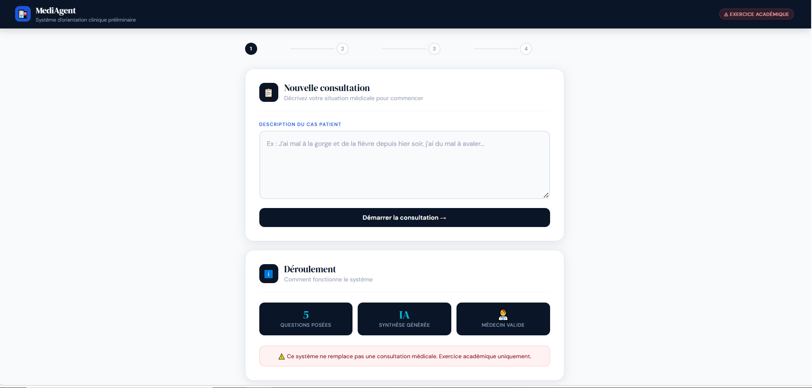
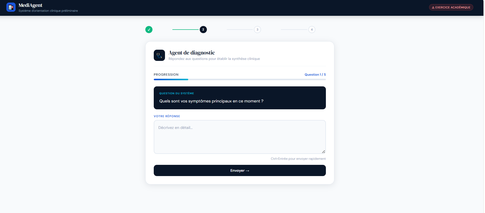
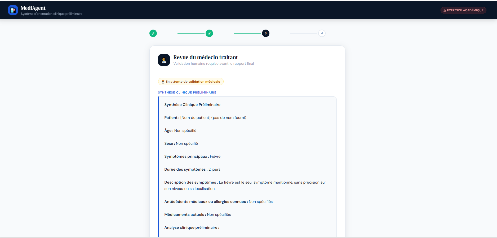
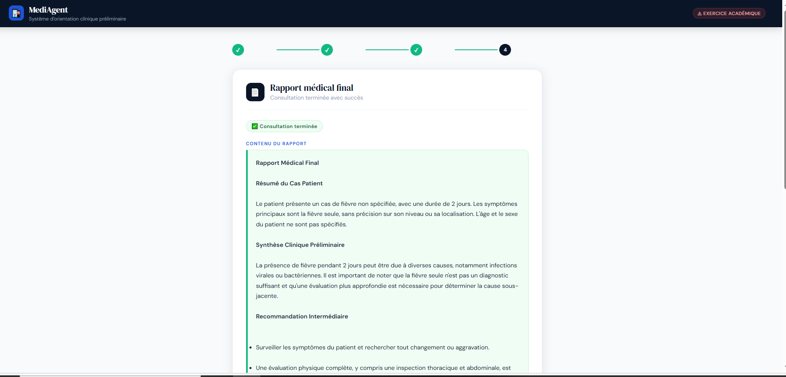

# Système Multi-Agents Médical

Projet académique — Orientation clinique préliminaire
Réalisé avec LangGraph, LangChain, FastAPI, MCP et React.

> ⚠️ Ce système ne remplace pas une consultation médicale.
> Il s'agit d'un exercice académique uniquement.

---

## Technologies utilisées

- **LangGraph** — orchestration du workflow multi-agents
- **LangChain + Ollama (llama3.2)** — modèle LLM local
- **FastAPI** — exposition du graphe via API REST
- **MCP (Model Context Protocol)** — intégration d'outils externes
- **React** — interface utilisateur

---

## Architecture

```
medical-multiagent/
├── backend/
│   ├── app/
│   │   ├── graph.py              # Graphe LangGraph principal
│   │   ├── state.py              # État partagé (MedicalState)
│   │   ├── api.py                # API FastAPI
│   │   ├── nodes/
│   │   │   ├── supervisor.py     # Orchestrateur
│   │   │   ├── diagnostic_agent.py  # Agent diagnostic
│   │   │   ├── physician_review.py  # Human-in-the-Loop
│   │   │   └── report_agent.py   # Agent rapport
│   │   └── tools/
│   │       ├── patient_tools.py  # Outil ask_patient
│   │       ├── care_tools.py     # Outil recommend_interim_care
│   │       └── mcp_client.py     # Client MCP
│   ├── langgraph.json
│   └── requirements.txt
├── mcp_server/
│   └── server.py                 # Serveur MCP (port 8001)
├── frontend/
│   └── medical-frontend/         # Application React
└── README.md
```

---

## Workflow du graphe

```
START
  │
  ▼
Supervisor
  │
  ▼
DiagnosticAgent ──► ask_patient (×5 questions)
  │                 recommend_interim_care (via MCP)
  ▼
Supervisor
  │
  ▼
PhysicianReview (Human-in-the-Loop)
  │    Le médecin soumet son traitement via l'API
  ▼
Supervisor
  │
  ▼
ReportAgent ──► Génère le rapport final structuré
  │
  ▼
END
```

---

## Installation et lancement

### Prérequis

- Python 3.12+
- Node.js 18+
- Ollama installé avec le modèle llama3.2

### 1. Installer Ollama et le modèle

```bash
# Télécharger Ollama sur https://ollama.com
ollama pull llama3.2
```

### 2. Cloner et installer le backend

```bash
cd backend
python -m venv venv

# Windows
venv\Scripts\activate

# Mac/Linux
source venv/bin/activate

pip install -r requirements.txt
```

### 3. Lancer le serveur MCP (Terminal 1)

```bash
cd backend
venv\Scripts\activate
cd ..\mcp_server
python server.py
# MCP server running on http://127.0.0.1:8001
```

### 4. Lancer l'API FastAPI (Terminal 2)

```bash
cd backend
venv\Scripts\activate
uvicorn app.api:app --reload --port 8000
# API running on http://127.0.0.1:8000
# Swagger UI: http://127.0.0.1:8000/docs
```

### 5. Lancer le frontend React (Terminal 3)

```bash
cd frontend/medical-frontend
npm install
npm start
# Frontend running on http://localhost:3000
```

---

## Utilisation

### Via le frontend (recommandé)

1. Ouvrir **http://localhost:3000**
2. Décrire le cas patient
3. Répondre aux 5 questions du Diagnostic Agent
4. Le médecin soumet son traitement (écran 3)
5. Consulter le rapport final (écran 4)

### Via l'API (Swagger UI)

1. Ouvrir **http://127.0.0.1:8000/docs**
2. `POST /consultation/start` — démarrer une consultation
3. `POST /consultation/resume` — répondre à chaque question
4. `POST /consultation/physician` — soumettre le traitement médecin
5. `GET /consultation/{thread_id}/report` — récupérer le rapport

---

## Jeux de tests

### Cas 1 — Syndrome respiratoire simple
```
Cas initial : "J'ai mal à la gorge et de la fièvre depuis hier"
```

### Cas 2 — Cas avec red flags
```
Cas initial : "J'ai du mal à respirer et une douleur thoracique"
```

### Cas 3 — Cas bénin
```
Cas initial : "J'ai un léger rhume depuis ce matin, nez qui coule"
```

---

## Endpoints API

| Méthode | Endpoint | Description |
|---------|----------|-------------|
| POST | /sessions/start | Créer un nouveau thread |
| POST | /consultation/start | Démarrer une consultation |
| POST | /consultation/resume | Soumettre une réponse patient |
| POST | /consultation/physician | Soumettre le traitement médecin |
| GET | /consultation/{thread_id} | État actuel de la consultation |
| GET | /consultation/{thread_id}/report | Rapport final |

---

## Agents

| Agent | Rôle |
|-------|------|
| Supervisor | Orchestre le workflow, décide du prochain agent |
| DiagnosticAgent | Pose 5 questions, produit la synthèse clinique |
| PhysicianReview | Human-in-the-Loop, validation médicale |
| ReportAgent | Génère le rapport final structuré |

---

## Outils MCP

| Outil | Description |
|-------|-------------|
| recommend_interim_care | Recommandation intermédiaire générale |
| get_red_flags | Détection des signes d'alarme |

---

## Critères éthiques

- Le système ne pose **aucun diagnostic définitif**
- Chaque rapport mentionne : *"Ce système ne remplace pas une consultation médicale"*
- Les termes utilisés : orientation clinique préliminaire, synthèse clinique
- Validation humaine obligatoire avant le rapport final

---
## Captures d'écran

### Écran 1 — Saisie du cas patient


### Écran 2 — Questions / Réponses


### Écran 3 — Revue du médecin


### Écran 4 — Rapport final


## Auteur

Projet réalisé par Sara Bouras & Fatima Ezzahra Bougsissa dans le cadre du cours de Prof. Mohamed YOUSSFI
Technologies : LangGraph, LangChain, FastAPI, MCP, React
```
